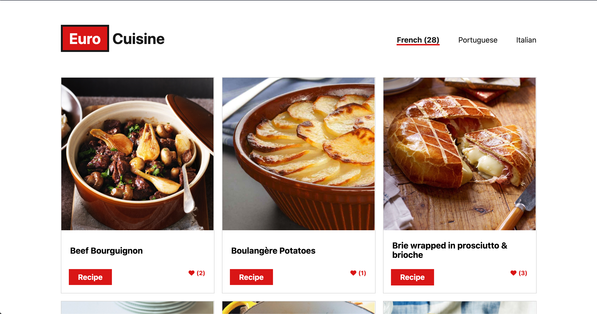

# Euro Cuisine

Euro Cuisine is a vanilla JavaScript project that retrieves data from two different external APIs. The App lists dishes from different European countries when the user interacts with the navbar.

<!--  -->

## Live Demo

[euro-cuisine-fbclh.netlify.app/](https://euro-cuisine-fbclh.netlify.app/)

## Built With

- JS | HTML | CSS | Webpack | Jest

## Getting Started

Clone

```sh
   git clone git@github.com:fbclh/euro-cuisine.git
```

Run

```sh
   cd euro-cuisine
   npm install
   npm start
```
## Authors
### Fabio Coelho

- GitHub: [github.com/fbclh](https://github.com/fbclh)
- LinkedIn: [linkedin.com/in/fbclh](https://www.linkedin.com/in/fbclh)

### Ivan Silva

- GitHub: [github.com/iKuartz](https://github.com/iKuartz)
- LinkedIn: [linkedin.com/in/ivan-silva](https://www.linkedin.com/in/ivan-silva-a47058b3/)

## Contributing

Contributions, issues, and feature requests are welcome, feel free to check the [issues page](../../issues/).

## License

This project is [MIT](LICENSE) licensed.
